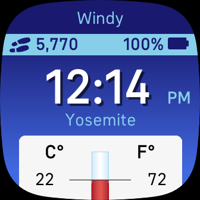

# Mercury Clock
A Fitbit watch face designed to display weather information. Celsius and Fahrenheit temperature are both always displayed in an old fashion mercury thermometer. In addition the current time, current weather condition, name of current location, step count, and battery percentage are also displayed. 

Note: If the watchface is unable to retrive or process the current weather condition, the weather condition feild be show up blank.

This watch face is pending approval by Fitbit to be published. [Fitbit App Gallery listing](https://gallery.fitbit.com/details/5ea66f1d-5f08-44ba-bb91-6b4fb04d558f?key=f124478e-395e-4a30-8a00-f8971d1e053e) 

Troubleshooting: If the temperature or weather information does not show up: 
- Ensure that watch-face permissions are enabled. 
- Ensure that Fitbit app permissions on phone, including location services and background refresh, are enabled. 
- Try toggling on and off location services and background refresh permissions for Fitbit app on your phone. 
- Try reinstalling watch-face. 
- Try turning on and off on your phone. 
- Perform synching after above steps.
